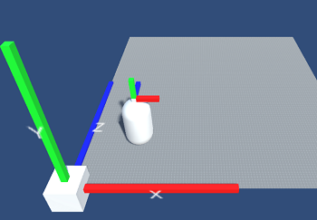
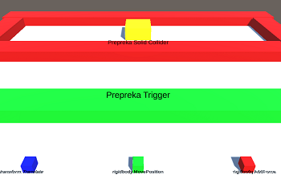
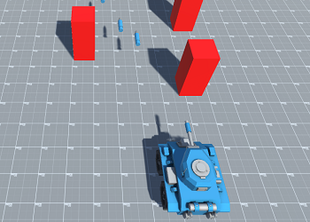
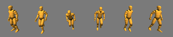
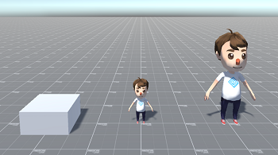
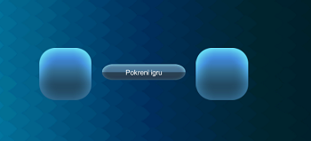
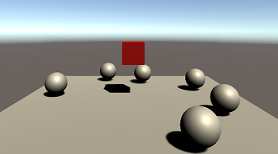

Ovaj Unity projekat je kreiran za LAUDA radionicu razvoja video igara za srednjoškolce.
Sadrži 5 foldera od kojih svaki pokriva jednu lekciju i bitan Unity koncept:

#### Nedelja2: Pomeranje objekata - Kako pomeriti objekat u Unity sceni?
 
Demo scena ima globalni koordinatni sistem sa markerima za svaku osu. Na igračevoj glavi su takođe markeri koji predstavljaju njegov lokalni koordinatni sistem.
**Kontroler** skripta koristi WASD kontrole da pomera igrača po terenu. Koriste se takođe tipke L i G, da se igrač teleportuje napred po Lokalnom i Globalnom koordinatnom sistemu, što vodi do različitog ponašanja ukoliko igrač nije poravnat sa globalnim sistemom.

#### Nedelja3: Rigidbody komponenta - Kako koristimo fiziku u Unity?
 

Demo scena ima tri kocke koje igrač može da pomera sa WASD, ali svaka koristi drugačiju metodu da bi izvršila to pomeranje:
* `Transform.Translate()` pomera kocku koristeći njenu Transform komponentu. Ovaj način pomeranja ima veoma visok nivo kontrole ali dovodi do nekonzistentnih sudara, pogotovo prilikom povećanja brzine kretanja.
* Podešavanje `Rigidbody.velocity` direktno. Ovaj način kretanja rezultuje visokim nivoom kontrole i konzistentnim sudarima, ali takođe i fizički nerealnim ponašanjem.
* `RigidBody.AddForce()` pomera kocku nanoseći silu u pravcu u kojem igrač pritiska tipke. Ovaj način kretanja ima najrealnije ponašanje i konzistentne sudare, ali i nizak nivo kontrole.

Sva tri načina kretanja su legitimna i mogu se koristiti, samo je pitanje kada želimo da koristimo koji.

Scena takođe ima dve prepreke, kocke koje na sebi imaju Collider komponente. Prva ima podešen **isTrigger**, što znači da se ne koristi za sudaranje sa telima, već samo kao aktivator za određene akcije (npr detekciju kada igrač prolazi kroz neki deo scene). Druga prepreka nema podešen ovaj parametar, pa stoga kocke koje igrač kontroliše preko fizike ne mogu da prođu kroz nju.
Obe prepreke imaju `OnTriggerEnter(Collider other)` i `OnCollisionEnter(dollision sollision)` implementirane, pa prilikom prolaska ili dodira igrača vidimo pozive ovih funkcija i ispise u konzoli.

#### Nedelja4: Prefabi - Šta su i kako ih ubacujemo u scenu?
 

Demo scena ima model tenka koji igrač može da kontroliše. A i D tipke za pomeranje, Space tipka za pucanje.
Na sceni je **KreatorNeprijatelja** sa istoimenom skriptom koja koristi `InvokeRepeating()` metodu da periodično kreira neprijatelja na nasumičnoj poziciji.
Prefab projektila na sebi ima skriptu **UnistiNaDodir** koja na poziv `OnTriggerEnter()` metode uništava GameObject koji dotakne, pa zatim i sebe.

#### Nedelja5: Animacija - Kako animiramo modele?
Ovaj folder ima dve scene:

 

SviPokreti scena pokazuje sve animacije koje smo skinuli u paketu humanoidnih animacija sa Asset Store-a.
 

Demo scena ima dva kontrolera igrača i kocku, svaki sa svojim Animator komponentom.
Na kocku smo dodali jednu animaciju koja je pomera i menja joj boju.
Animatori igrača koriste humanoidne animacije, i razlikuju se po kompleksnosti menjanja između tih animacija. Oba igrača imaju animacije stojanja, hodanja i skoka. Veći igrač ima i posebne animacije za kretanje u vazduhu i doskok.

#### Nedelja6: Interfejs i Zvuk - Kako dodati meni u igru i pustiti zvuk u sceni?
  

Meni scena ima osnovne elemente interfejsa, slike i dugme za pokretanje scene Nivo1:
 

U ovoj sceni, igrač može da koristi kursor kako bi pritiskom na sfere pomerao crvenu kocku.
Koristimo metode `Camera.main.ScreenPointToRay()` i `Physics.Raycast()` da bismo definisali **gde** se pomeramo, zatim `Vector3.Lerp()` metodu da definišemo **kako** da se pomerimo. Sfere na sebi imaju implementirane `OnTriggerEnter()` metode u kojima puštaju zvuk. Ovu metodu implementira i skripta **PomeranjeKockeMisem** da bi povećala broj poena, i prilikom sakupljanja dovoljno poena učitava nazad Meni scenu.

Svi modeli korišćeni u projekti se besplatno mogu nabaciti na Unity Asset Store:

[Cartoon Tank Free](https://assetstore.unity.com/packages/3d/vehicles/land/cartoon-tank-free-165189)

[Basic Motisons Free Pack](https://assetstore.unity.com/packages/3d/animations/basic-motions-free-pack-154271)

[Character Pack: Free Sample](https://assetstore.unity.com/packages/3d/characters/humanoids/character-pack-free-sample-79870)

[Simple Button Set 02](https://assetstore.unity.com/packages/2d/gui/icons/simple-button-set-02-184903)

